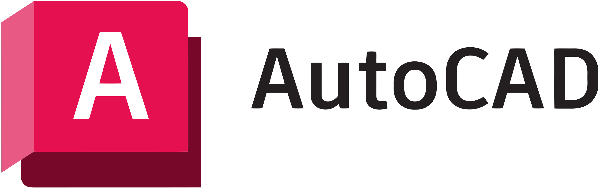

# WASM + Rust tutorial

# Spis treści

- [WASM + Rust tutorial](#wasm--rust-tutorial)
- [Spis treści](#spis-treści)
  - [1. Czym jest WebAssembly?](#1-czym-jest-webassembly)
  - [2. Jak działa WebAssembly?](#2-jak-działa-webassembly)
  - [3. Gdzie jest używane WASM?](#3-gdzie-jest-uzywane-wasm)
  - [4. Zalety i wady WASM?](#4-zalety-i-wady-wasm)
  - [5. Setup projektu](#5-setup-projektu)
    - [5.1 Potrzebne narzędzia](#51-potrzebne-narzędzia)
    - [5.2 Tworzenie biblioteki](#52-tworzenie-biblioteki)
    - [5.3 Buildowanie](#53-buildowanie)
    - [5.4 Zastosowanie](#54-zastosowanie)
  - [6. Prosty przykład - Kółko i krzyżyk](#6-prosty-przykład---kółko-i-krzyżyk)
    - [Dyrektywa `wasm-bindgen`](#dyrektywa-wasm-bindgen)
    - [Komunikacja Rust \<-\> JS](#komunikacja-rust---js)
    - [Rezultat końcowy](#rezultat-końcowy)
  - [7. Podsumowanie](#7-podsumowanie)
    - [Porównanie kodu Yew i React](#porównanie-kodu-yew-i-react)

## 1. Czym jest WebAssembly?
<br/>
WASM to nowoczesny format binarny o wysokiej wydajności, zaprojektowany do wykonywania w przeglądarkach internetowych. Umożliwia uruchamianie kodu napisane w różnych językach programowania na stronach internetowych, zapewniając prędkość porównywalną z natywnymi aplikacjami.

Garść informacji:
- pracę nad WASM rozpoczęto w 2015 roku
- w grudniu 2019 roku został zaakceptowany jako standard przez W3C
- nazwa nawiązuje do Assemblera, z racji niskopoziomowego kodu
-  został czwartym językiem natywnie obsługiwanym w przeglądarkach internetowych, dołączając do HTML, JavaScript, oraz CSS

## 2. Jak działa WebAssembly?

<br/>
<br/>

Proces kompilacji WASM zaczyna się od języka źródłowego, takiego jak C++, Rust lub innego, który jest kompatybilny z WASM.

Kompilacja do WASM: Kod źródłowy jest kompilowany do formatu WebAssembly przez dedykowany kompilator. Na przykład dla C++ używany jest `Emscripten`, a dla Rust - `wasm-pack`.
<br/>


<br/>
<br/>

Generowanie pliku `.wasm`: Kompilator generuje plik `.wasm`, który jest binarny i gotowy do użycia na stronach internetowych.

Załadowanie pliku `.wasm` na stronie internetowej: Plik jest ładowany do przeglądarki za pomocą JavaScriptu, który następnie może wywoływać z niego funkcje.

Przykład ładowania pliku `.wasm` w Javascripcie:
```js
(async () => {
  const response = await fetch('fibonacci.wasm');
  const buffer = await response.arrayBuffer();
  const module = new WebAssembly.Module(buffer);
  const instance = new WebAssembly.Instance(module);
  const result = instance.exports.fibonacci(42);
  console.log(result);
})();
```


W ten sposób WebAssembly pozwala na wykorzystanie kodu z różnych języków programowania na stronach internetowych i zapewnia dużą wydajność w porównaniu z tradycyjnym JavaScriptem.

## 3. Gdzie jest używane WASM?

### Figma

<br/>


### AutoCad


## 4. Zalety i wady WASM

### Zalety
- Wydajność - oferuje wydajność zbliżoną do kodu natywnego, co jest znaczną poprawą w porównaniu do tradycyjnego JavaScriptu. Dzięki temu aplikacje webowe mogą działać szybciej i bardziej płynnie
- Przenośność - Kod WebAssembly jest binarny i przenośny, co oznacza, że może być łatwo przenoszony i uruchamiany na różnych platformach i urządzeniach bez konieczności modyfikacji.
- Językowo niezależny - WebAssembly można tworzyć przy użyciu różnych języków programowania, takich jak C, C++, Rust
- mniejsze rozmiary plików w stosunku do JS

### Wady
- brak garbage collector
- komunikuje się z DOM'em przez Javascript, a nie bezpośrednio

## 5. Setup projektu

### 5.1 Potrzebne narzędzia

Przed rozpoczęciem tworzenia projektu WebAssembly w Rust-cie, musimy pobrać odpowiednie narzędzia.

`Rust`

Z oczywistych względów.
```
curl --proto '=https' --tlsv1.2 -sSf https://sh.rustup.rs | sh
```
`wasm-pack`

Narzędzie służące m.in. do kompilowania kodu Rust-a do WebAssembly.

```
cargo install wasm-pack
```

### 5.2 Tworzenie biblioteki
Na początku stwórzmy nową bibliotekę Rust-a o nazwie tutorial.
```
cargo new --lib tutorial
```
W katologu, którym wywołaliśmy te komendę stworzy się taka struktura
```
|--tutorial
   |--Cargo.toml
   |--src
      |--lib.rs
```
W pliku `lib.rs` będziemy pisać kod Rust-a, który będzie kompilowany do **WASM**.
Dla przykładu napiszmy coś takiego (później wyjaśnimy).
```rust
use wasm_bindgen::prelude::*;

#[wasm_bindgen]
extern {
    pub fn alert(s: &str);
}

#[wasm_bindgen]
pub fn greet(name: &str) {
    alert(&format!("Hello, {}!", name));
}
``` 
### 5.3 Buildowanie
Zbuildujmy teraz nasz prosty kod. W pliku `Cargo.toml` dodajmy dwie rzeczy:
```toml
[lib]
crate-type = ["cdylib"]

[dependencies]
wasm-bindgen = "0.2"
```
 W konsoli wpisujemy:
```
wasm-pack build --target web
```
To polecenie skompiluje nasz kod Rust-a do WebAssembly oraz stworzy plik JS, który zamieni plik WASM w moduł zrozumiały dla przeglądarki.
Następnie stworzy folder `pkg`, w którym zamieści powstałe pliki oraz na podstawie `Cargo.toml` stworzy `package.json`.

*Dodanie flagi --target web umożliwia importowanie stworzonych plików JS jako natywne moduły ES. Domyślnie `wasm-pack` builduje kod z flagą **bundler**, przez co tworzy kod przeznaczony do pracy z bundlerami, np. Webpackiem.*

Teraz nasza struktura plików powinna wyglądać tak:
```
├── Cargo.lock
├── Cargo.toml
├── pkg
│   ├── tutorial.d.ts
│   ├── tutorial.js
│   ├── tutorial_bg.wasm
│   ├── tutorial_bg.wasm.d.ts
│   └── package.json
├── src
│   └── lib.rs
└── target
    ├── CACHEDIR.TAG
    ├── release
    └── wasm32-unknown-unknown
```

**`tutorial_bg.wasm`**

Plik binarny WebAssembly generowany przez kompilator Rust-a. Zawiera wszystkie funkcje i dane stworzone przez nas w Rust-cie. 

**`tutorial.js`**

Plik *.js* generowany przez `wasm-pack`. Zawiera w sobie mechanizmy dzięki, którym możemy importować **DOM** i funkcje JavaScriptu do Rust-a oraz API do WebAssembly. Zawiera również funkcje napisane przez nas w Rust-cie.

**`tutorial.d.ts`**

Plik *.d.ts* zawierający deklarację typów w TypeScript. Przydatny gdy używamy TypeScriptu przy pracy z WebAssembly, ponieważ umożliwia np. podpowiedzi ze strony IDE.

**`tutorial_bg.d.ts`**

Podobnie jak powyższy plik zawiera deklaracje typów dla funkcji wykorzystywanych w API do WebAssembly.


### 5.4 Zastosowanie

Dodajmy plik `index.html`, w którym użyjemy funkcji `greet` napisanej przez nas w Rust-cie.
```
├── Cargo.lock
├── Cargo.toml
├── index.html  <-- plik .html
├── pkg
│   ├── tutorial.d.ts
│   ├── tutorial.js
│   ├── tutorial_bg.wasm
│   ├── tutorial_bg.wasm.d.ts
│   └── package.json
├── src
│   └── lib.rs
└── target
    ├── CACHEDIR.TAG
    ├── release
    └── wasm32-unknown-unknown
```

W pliku `index.html` wpisujemy:
```html
<!doctype html>
<html lang="pl-PL">
  <head>
    <meta charset="utf-8" />
    <title>wasm tutorial</title>
  </head>
  <body>
    <script type="module">
      import init, { greet } from "./pkg/tutorial.js";
      init().then(() => {
        greet("world!");
      });
    </script>
  </body>
</html>
```

Żeby zobaczyć efekt naszej pracy musimy użyć prostego lokalnego serwera http (np. rozszerzenia **LiveServer** w Visual Studio Code lub komendy `python3 -m http-server`).

Po włączeniu serwera zobaczymy:


## 6. Prosty przykład - Kółko i krzyżyk

Napiszmy wszystkim znaną grę w kółko i krzyżyk przy pomocy WebAssembly i Rust-a.

Rust będzie odpowiedzialny za logikę oraz stan gry, a JavaScript za interakcję użytkownika.

*Cały kod Rust-a będziemy pisać w pliku **lib.rs**.*
### Dyrektywa `wasm-bindgen`
Przed rozpoczęciem warto wytłumaczyć czym jest tajemnicza dyrektywa `#[wasm-bindgen]`. 
Jej zastosowanie jest bardzo proste. Umieszczając te dyrektywe przed struktura/implementacją/funkcją dajemy kompilatorowi znać, że chcemy żeby dana funkcja była dostępna z poziomu JavaScripta. Jednocześnie gdy chcemy użyć funkcji JS-owej w Rust-cie możemy użyć tej dyrektywy przed blokiem `extern`.
```rust
use wasm_bindgen::prelude::*;

#[wasm_bindgen]
extern { // <-- funkcja zewnętrzna
    pub fn alert(s: &str); // <-- JS-owy alert
}

#[wasm_bindgen]
pub fn greet(name: &str) { // <-- przekazujemy JS-owi funkcje greet
    alert(&format!("Hello, {}!", name)); // <-- wykorzystujemy funkcję alert
}
``` 

Zacznijmy od stworzenia typu wyliczeniowego odpowiedzialnego za przechowywanie stanu pojedynczej komórki
```rust
#[wasm_bindgen]
#[repr(u8)] // chcemy żeby każdy enum zajmował tylko jeden bajt
#[derive(Clone, Copy, Debug, PartialEq, Eq)]
pub enum Cell {
    Empty = 0,
    Circle = 1,
    Cross = 2,
}
```
typu wyliczeniowego, który będzie przechowywał obecny stan gry
```rust
#[wasm_bindgen]
#[repr(u8)]
#[derive(Clone, Copy, Debug, PartialEq, Eq)]
pub enum GameState {
    GameOn = 0,
    CircleWon = 1,
    CrossWon = 2,
    Draw = 3,
}

```
oraz struktury reprezentującej plansze do gry w kółko i krzyżyk
```rust
#[wasm_bindgen]
pub struct Board {
    turn: u32,
    cells: [Cell; 9],
    game_state: GameState,
}
```
Pole `cells` przechowujące zawartość każdej komórki jest tablicą jednowymiarową dla ułatwienia komunikacji między Rust-em i JS-em (o tym też później). Do otrzymania indeksu odpowiedniego wiersza i kolumny użyjemy funkcji
```rust
#[wasm_bindgen]
impl Board{
// ...
pub fn get_index(row: u32, column: u32) -> usize {
        (row * 3 + column) as usize
    }
// ...
}
```
Funkcja sprawdzająca skończenie gry
```rust
#[wasm_bindgen]
impl Board{
// ...
fn check_game_end(&mut self) -> GameState {
        let winning_combos: [[usize; 3]; 8] = [
            [0, 1, 2], // first row
            [3, 4, 5], // second row
            [6, 7, 8], // third row
            [0, 3, 6], // first column
            [1, 4, 7], // second column
            [2, 5, 8], // third column
            [0, 4, 8], // first diagonal
            [2, 4, 6], // second diagonal
        ];

        for &combo in &winning_combos {
            let [a, b, c] = combo;
            if self.cells[a] != Cell::Empty
                && self.cells[b] != Cell::Empty
                && self.cells[c] != Cell::Empty
                && self.cells[a] == self.cells[b]
                && self.cells[b] == self.cells[c]
            {
                if self.cells[a] == Cell::Circle {
                    return GameState::CircleWon;
                } else {
                    return GameState::CrossWon;
                }
            }
        }
        if self.turn == 9 {
            return GameState::Draw;
        }
        return GameState::GameOn;
    }
    // ...
}
```
Funkcja zaznaczająca pole
```rust
pub fn check_box(&mut self, row: u32, column: u32) {
        let index: usize = Self::get_index(row, column);
        if self.cells[index] == Cell::Empty && self.game_state == GameState::GameOn && self.turn < 9
        {
            let cell_to_place: Cell = if self.turn % 2 == 0 {
                Cell::Circle
            } else {
                Cell::Cross
            };

            self.cells[index] = cell_to_place;
            self.turn += 1;
            self.game_state = self.check_game_end();
        }
    }
```
I to **prawie** wszystko jeśli chodzi o Rust-a...

Przejdźmy do JS-a. Nie będziemy się zagłębiać w HTML i CSS.

W pliku `index.js` - zaimportujmy Rust-owe struktury oraz stwórzmy nową planszę.
```js
import { Board, GameState, Cell } from "tutorial";

const board = Board.new();
```
W tym momencie jest szansa, że przyjdzie myśl - *"Jak dostaniemy informacje o komórkach?"*.

### Komunikacja Rust <-> JS
Jest to jeden z ważniejszych konceptów w WebAssembly. Z racji na to, że w JS instancje `Object`, `Array` i węzły `DOM-u` są alokowane na heap-ie, który jest obsługiwany przez **garbage-collector**, to ta pamięć jest oddzielona od liniowej przestrzeni pamięci WebAssembly. Co skutkuje tym, że Rust nie ma dostępu do pamięci JS-a (to może się zmienić - [patrz tutaj](https://github.com/WebAssembly/component-model)). Natomiast JS ma dostęp do **zapisu** oraz **odczytu** z pamięci WebAssembly, ale jedynie przez API `ArrayBuffer` dla wartości skalarnych(`u8`, `i32`, `f64`, itd... ).

Przy tworzeniu interfejsu pomiędzy JS a WebAssembly należy ograniczać kopiowanie do oraz z pamięci WebAssembly, jak również ograniczać serializowanie i deserializowanie danych.

Z założenia dobry interfejs JS <-> WASM to taki, w którym duże struktury danych są przechowywane w pamięci liniowej WebAssembly i są tylko przeznaczone do odczytu przez JS.


Dodajmy w takim razie taki interfejs do naszego mini-projektu. Do struktury `Board` dopiszmy funkcję zwracającą wskaźnik na pole `cells`.
```rust
#[wasm_bindgen]
impl Board {
// ...
pub fn cells(&self) -> *const Cell {
        self.cells.as_ptr()
    }
}
// ...
```
A w `index.js` zaimportujmy moduł `memory` potrzebny do stworzenia buffora na dane.
```js
import { memory } from "tutorial/tutorial_bg.wasm";
```
Dzięki temu jesteśmy w stanie odczytać dane przechowywane w tablicy `cells`. 
```js
const drawCells = () => {
  const cellsPtr = board.cells(); // pobranie wskaźnika na tablice cells
  const cellsBuffer = new Uint8Array(memory.buffer, cellsPtr, 9); // stworzenie buffora, który pobierze 9 bajtów z tablicy `cells`
  cells.forEach((cell, idx) => {
    let symbol;
    switch (cellsBuffer[idx]) {
      case Cell.Circle:
        symbol = "O";
        break;
      case Cell.Cross:
        symbol = "X";
        break;
      case Cell.Empty:
        symbol = "";
        break;
      default:
        symbol = "";
        break;
    }
    cell.innerText = symbol;
  });
};
```
Ostatecznie cały kod JS prezentuje się tak
```js
import { Board, GameState, Cell } from "tutorial";
import { memory } from "tutorial/tutorial_bg.wasm";

const board = Board.new();

const cells = document.querySelectorAll(".cell");

const click = (row, col) => {
  board.check_box(row, col);
  drawCells();
  checkWin(board.game_state());
};
const checkWin = (gameState) => {
  switch (gameState) {
    case GameState.CircleWon:
      alert("Circle Won!");
      break;
    case GameState.CrossWon:
      alert("Cross Won!");
      break;
    case GameState.Draw:
      alert("Draw");
      break;
    case GameState.GameOn:
      break;
  }
};
const drawCells = () => {
  const cellsPtr = board.cells();
  const cellsBuffer = new Uint8Array(memory.buffer, cellsPtr, 9);
  cells.forEach((cell, idx) => {
    let symbol;
    switch (cellsBuffer[idx]) {
      case Cell.Circle:
        symbol = "O";
        break;
      case Cell.Cross:
        symbol = "X";
        break;
      case Cell.Empty:
        symbol = "";
        break;
      default:
        symbol = "";
        break;
    }
    cell.innerText = symbol;
  });
};

cells.forEach((cell) => {
  cell.onclick = () => click(parseInt(cell.id[0]), parseInt(cell.id[2]));
});

```
### Rezultat końcowy


## 7. Podsumowanie
`wasm_bindgen` umożliwia proste tworzenie interfejsów między Rust-em i JS-em. Dzięki temu możemy wykorzystać szybkość Rust-a podczas tworzenia aplikacji webowych. Istnieją również biblioteki UI stworzone w Rust-cie do WebAssembly, które znacznie ułatwiają tworzenie front-endu. Jedną z popularniejszych bibliotek jest [Yew](https://yew.rs/).
### Porównanie kodu Yew i React
```rust
use yew::prelude::*;

#[function_component]
fn App() -> Html {
    let counter = use_state(|| 0);
    let onclick = {
        let counter = counter.clone();
        move |_| {
            let value = *counter + 1;
            counter.set(value);
        }
    };

    html! {
        <div>
            <button {onclick}>{ "+1" }</button>
            <p>{ *counter }</p>
        </div>
    }
}
```
```tsx
import { useState } from "react"

const App = () => {
  const [counter, setCounter] = useState<number>(0);
  const onClick = () => {
    setCounter((counter) => counter+1);
  }

  return(
    <div>
      <button onClick={onClick}>"+1" </button>
      <p>{ counter }</p>
    </div>
  )
}
```
